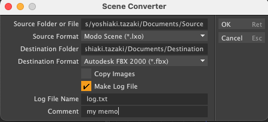

# Scene Converter for Modo

This is a Python script to convert scene files to other format for Foundry 3DCG application Modo. This is useful if you want to convert multiple scene files saved in a source folder to other destination folders in bulk. It scans source scenes files under sub-folders of the source folder and saves the converted scene files to maintain the same hierarchies. This kit contains a Modo command (**scene.converter**) written by Python script and it works on all Modo platforms (macOS, Windows and Linux).

これは3DCGアプリケーションのModoで保存されているシーンファイルを一括して他のフォーマットに変換して保存するPythonスクリプトです。変換元のフォルダーに保存されている複数のシーンファイルを一括で指定した保存先のフォルダーに変換したい時に便利です。スクリプトは変換元のフォルダーとその下層にある変換元のシーンファイルを検索し、変換先のフォルダーの下に同じ階層構造で変換したシーンファイルを保存します。このキットにはPythonスクリプトで書かれた**scene.converter**というModoのコマンドが含まれており、Modoの全てのプラットフォームで動作します (macOS, Windows and Linux)。

## Installation
Drag and drop SceneConverter_v1.lpk file on Modo viewport. You can see "SceneConverter_v1 Kit installation complete." if the installation is succesfull. The kit is installed in Modo User Folder.

SceneConverter_v1.lpkをModoのビューポートにドラッグ&ドロップしてください。インストールが成功すると"SceneConverter_v1 Kit installation complete."というメッセージが表示されます。

## How to Run
Type **scene.converter** on command filed of Command History viewport. You can see the following command panel.

コマンド履歴のビューポートのコマンド入力フィールドで**scene.converter**をタイプしてください。下記のようなコマンドパネルが表示されます。

## Options
- **Source Folder or File**:  
Set the source folder name which contains scene files to be converted. You can set a sigle scene filename instead of folder name if you want to convert a single scene file.  
変換元のシーンファイルがあるフォルダー名称を指定します。単一のシーンファイルを変換したい場合は、シーンファイル名称を指定することもできます。
- **Source Format**:  
Set the scene file format for the source scene files to be converted. SceneConverter scans all scene files with the extension in the source folder and the sub-folders.  
変換元のシーンファイルフォーマットを指定します。シーンコンバーターは指定したフォーマットの拡張子を持つシーンファイルを変換元のフォルダーとそのサブフォルダーから検索します。
- **Destination Folder**:  
Set the destination folder name to save converted scene files. If the destination folder is not existed, SceneConverter automatically creates new folders.  
変換したシーンファイルを保存する変換先のフォルダー名称を指定します。もし変換先フォルダーが存在しない灰は、自動的にフォルダーが作成されます。
- **Destination Format**:  
Set the scene file format for target scene files.  
変換先のシーンファイルフォーマットを指定します。
- **Copy Images**:  
Copy images in the source scene where the same folder with the converted scene file.  
シーンファイルで使用されている画像ファイルを変換したシーンファイルと同じフォルダにコピーします。
- **Make Log File**:  
Make log file with the list of converted files when this option is enabled.  
このオプションを有効にすると変換したファイルの一覧が書かれたログファイルが作成されます。
- **Log File**:  
Filename of the log file. The log file is created on the destination folder.  
ログファイルのファイル名称を指定します。ログファイルは変換先フォルダーに作られます。
- **Comment**:  
Write your memo as single string.  
ログファイルに書き込んでおきたいメモを文字列として設定することができます。